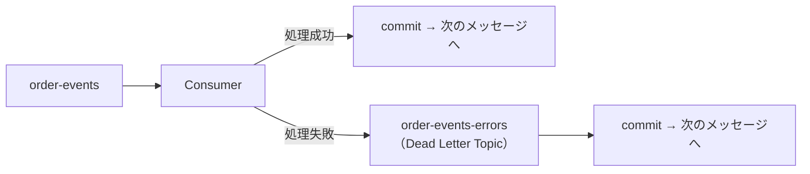
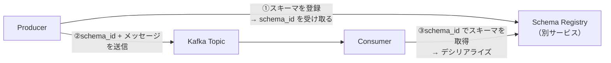

# ベストプラクティス

本番環境でKafkaを運用する際に知っておくべき考え方を整理する。

---

## 基本フロー：TopicにProducer/Consumerを追加する

新しいTopicを追加してProducer/Consumerを動かすまでの手順。以降のベストプラクティスはこの流れを前提にしている。

### 1. Topicを作る

設計で決めること：

| 項目 | 説明 |
|---|---|
| Topic名 | 用途がわかる名前（例：`order-events`、`user-actions`） |
| Partition数 | Consumerの最大並列数が上限になる。最初は3〜6程度 |
| Replication Factor | 本番は3、ローカル開発は1 |

```bash
docker compose exec kafka /opt/kafka/bin/kafka-topics.sh \
  --bootstrap-server localhost:9092 \
  --create \
  --topic <topic名> \
  --partitions 3 \
  --replication-factor 1
```

作成できたか確認する：

```bash
docker compose exec kafka /opt/kafka/bin/kafka-topics.sh \
  --bootstrap-server localhost:9092 --list
```

### 2. Producerを書く

```python
from kafka import KafkaProducer
import json

producer = KafkaProducer(
    bootstrap_servers="localhost:9092",
    value_serializer=lambda v: json.dumps(v).encode("utf-8"),
)

producer.send("<topic名>", {"key": "value"})
producer.flush()   # 送信バッファを強制的に送り切る
producer.close()
```

- キーによる順序保証が必要な場合は `key_serializer` と `key=...` を追加する（→ [フェーズ3](../phase3/README.md)）
- `flush()` を忘れると送信が保留されたまま終了することがある

### 3. Consumerを書く

```python
from kafka import KafkaConsumer
import json

consumer = KafkaConsumer(
    "<topic名>",
    bootstrap_servers="localhost:9092",
    group_id="<group名>",
    auto_offset_reset="earliest",
    value_deserializer=lambda v: json.loads(v.decode("utf-8")),
)

for message in consumer:
    print(message.value)
```

- `group_id`：同じIDのConsumerはPartitionを分担する（→ [フェーズ2](../phase2/README.md)）
- `auto_offset_reset="earliest"`：初回起動時にTopicの先頭から読む。`"latest"` にすると起動後の新着のみ受信する
- `enable_auto_commit` のデフォルトはTrue。処理の信頼性を上げるには手動コミットにする（→ [4. オフセットのコミット戦略](#4-オフセットのコミット戦略)）

### 4. Kafka UIで確認する

| 確認したいこと | 場所 |
|---|---|
| Topicが作成されたか | Topics → `<topic名>` → Overview |
| メッセージが届いているか | Topics → `<topic名>` → Messages |
| Consumerが読んでいるか | Topics → `<topic名>` → Consumers タブ（Consumer Lag を確認） |

---

## 1. メッセージの重複と冪等性

Kafkaは「少なくとも1回（at-least-once）」の配信を保証するため、ネットワーク障害時にメッセージが重複することがある。

**対策：Consumerを冪等（べきとう）に設計する**

冪等とは「同じ操作を何度繰り返しても結果が変わらない」こと。同じメッセージが2回届いても1回と同じ結果になるよう設計する。

```python
# 悪い例：同じメッセージが2回届くと二重引き落としになる
def process(message):
    charge(message["user_id"], message["amount"])

# 良い例：注文IDで処理済みかチェックし、2回目以降はスキップする
def process(message):
    if already_processed(message["order_id"]):
        return
    charge(message["user_id"], message["amount"])
    mark_as_processed(message["order_id"])
```

---

## 2. エラーハンドリング

Consumer内で例外が発生した場合、そのメッセージの処理が止まる。何も対策しないと後続のメッセージも詰まり続ける。

**Dead Letter Topic（DLT）**

処理できなかったメッセージを別のTopicに退避させる設計。後から原因調査・再処理ができる。



Consumer は通常の受信と同時に、失敗時の送信先として Producer も持つ。

```python
from kafka import KafkaConsumer, KafkaProducer
import json

consumer = KafkaConsumer(
    "order-events",
    bootstrap_servers="localhost:9092",
    group_id="order-processors",
    auto_offset_reset="earliest",
    enable_auto_commit=False,   # 処理成功後に手動でコミットする
    value_deserializer=lambda v: json.loads(v.decode("utf-8")),
)

# 失敗メッセージをDLTに送るためのProducer
dlt_producer = KafkaProducer(
    bootstrap_servers="localhost:9092",
    value_serializer=lambda v: json.dumps(v).encode("utf-8"),
)

for message in consumer:
    try:
        process(message.value)
        consumer.commit()  # 処理成功 → コミットして次へ
    except Exception as e:
        # 処理失敗 → DLTに退避してからコミット（同じメッセージを永遠にリトライしない）
        dlt_producer.send("order-events-errors", {
            "error": str(e),
            "original": message.value,
            "partition": message.partition,
            "offset": message.offset,
        })
        dlt_producer.flush()
        consumer.commit()
```

DLTに退避したメッセージは、後から原因を調査して別途再処理できる。`partition` と `offset` を一緒に保存しておくと元のメッセージに戻りやすい。

---

## 3. Partition数の設計

Partition数はTopicの作成後に増やせるが、減らせない。  
またPartition数はConsumerのスケール上限を決める（Consumer数 > Partition数は無意味）。

```
目安：
- 想定する最大Consumer数 = 最低限のPartition数
- スループット要件に応じて増やす
- 最初から多すぎると管理が複雑になる
```

---

## 4. オフセットのコミット戦略

| 方式 | 特徴 |
|---|---|
| 自動コミット（auto_commit） | シンプルだが処理前にコミットされる可能性あり |
| 手動コミット（manual commit） | 処理完了後にコミットするため安全 |

```python
# 手動コミットの例
consumer = KafkaConsumer(
    ...,
    enable_auto_commit=False,
)

for message in consumer:
    process(message.value)
    consumer.commit()  # 処理が成功してからコミット
```

---

## 5. メッセージのスキーマ管理

メッセージの形式（フィールド名・型）は時間とともに変わる。ProducerとConsumerが別チームの場合、フィールドの追加・削除・型変更でスキーマが合わなくなり障害になる。

**対策：Schema Registryを使う**

Schema Registry は Apache Kafka には含まれない**別サービス**。Confluent 社が開発したオープンソースのツールで、スキーマのバージョン管理と互換性チェックを担う。



**主な機能**

| 機能 | 説明 |
|---|---|
| スキーマの保存 | Avro / JSON Schema / Protobuf の3形式に対応 |
| バージョン管理 | スキーマの変更履歴を保持する |
| 互換性チェック | 後述の互換性モードに基づき、破壊的変更をデプロイ前に検出する |

**互換性モード（よく使うもの）**

| モード | 意味 |
|---|---|
| BACKWARD（デフォルト） | 新しいConsumerが古いメッセージを読める。フィールドの追加はOK、削除はNG |
| FORWARD | 古いConsumerが新しいメッセージを読める |
| FULL | 両方向で互換性を保つ |

**参考リンク**

- [Confluent Schema Registry（GitHub）](https://github.com/confluentinc/schema-registry) - OSSのソースコード
- [Confluent Schema Registry ドキュメント](https://docs.confluent.io/platform/current/schema-registry/index.html) - 公式ドキュメント

> このリポジトリの docker-compose.yml には Schema Registry は含まれていない。本番導入時に別途追加する。

---

## 6. 保持期間の設定

Kafkaはデータをディスクに保持するが、無限には保持しない。  
デフォルトは7日間。ユースケースに合わせて設定する。

```
# docker-compose.yml での設定例
KAFKA_LOG_RETENTION_HOURS: 168        # 7日間（デフォルト）
KAFKA_LOG_RETENTION_BYTES: 1073741824 # 1GB を超えたら古い順に削除
```

---

## 7. 監視すべき指標

| 指標 | 意味 | アラートの目安 |
|---|---|---|
| Consumer Lag | ConsumerがProducerに何件分遅れているか | 増加し続けるとき |
| Under-replicated Partitions | レプリカが揃っていないPartition数 | 0以外のとき |
| Producer Error Rate | 送信失敗率 | 0%超のとき |

Prometheus + Grafanaで可視化するのが一般的。

---

## チェックリスト

- [ ] Consumerは冪等に設計されているか（同じメッセージが2回来ても結果が変わらないか）
- [ ] エラー時にDead Letter Topicに退避しているか
- [ ] Partition数はスケール要件を満たしているか
- [ ] 手動コミットで「処理成功後にコミット」になっているか
- [ ] 保持期間がストレージ容量と整合しているか
- [ ] Consumer Lagを監視しているか

---

→ [学習を終えて](../README.md#学習を終えて)
