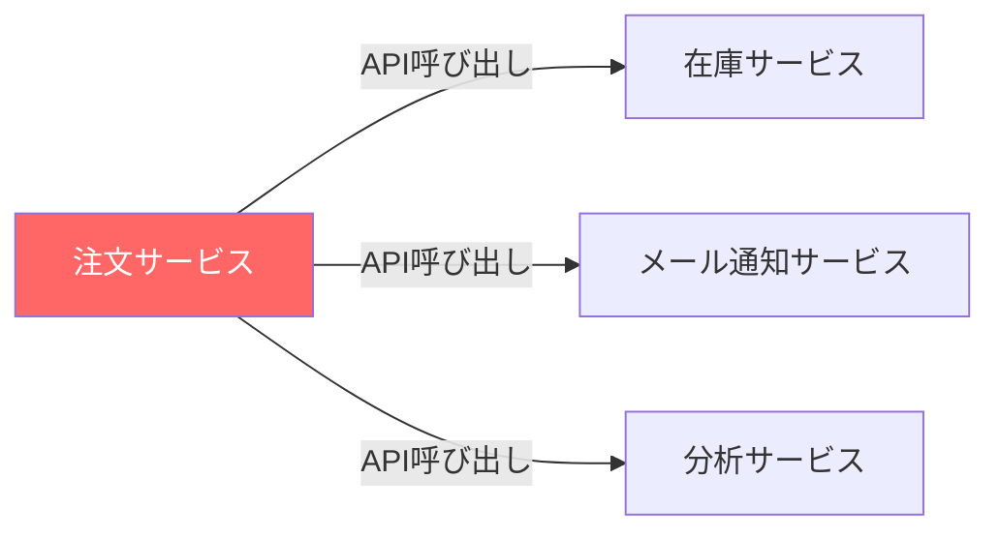
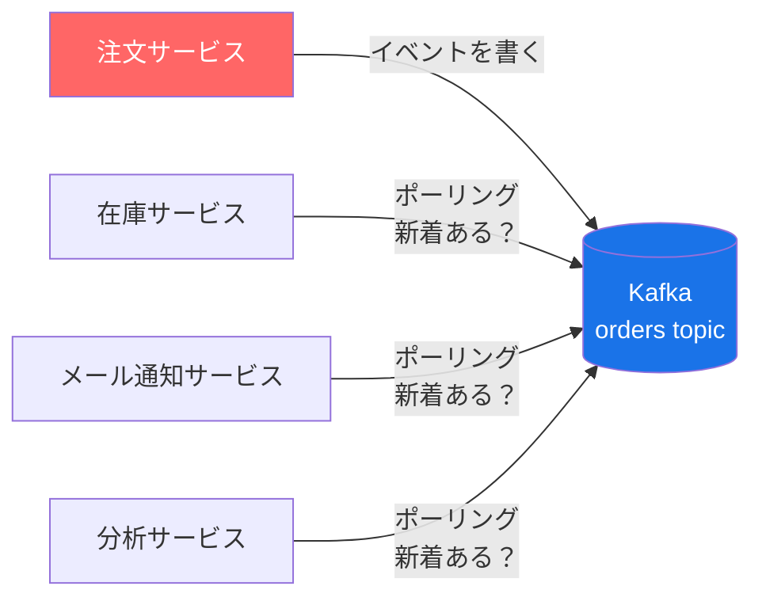
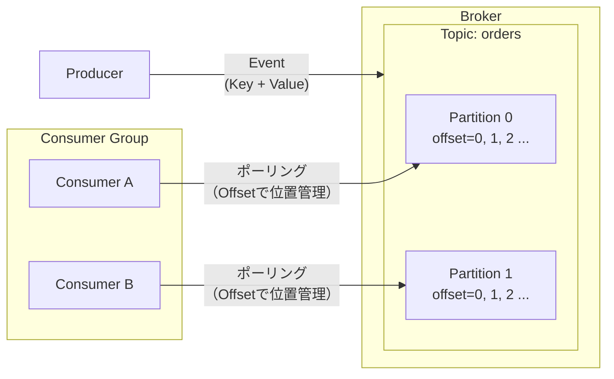
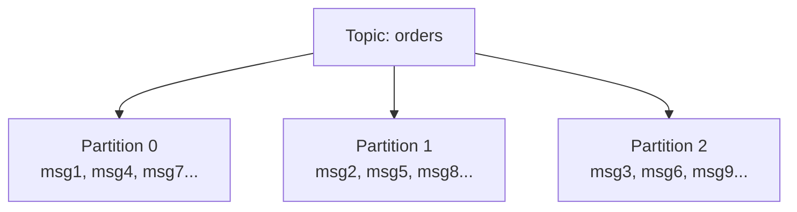
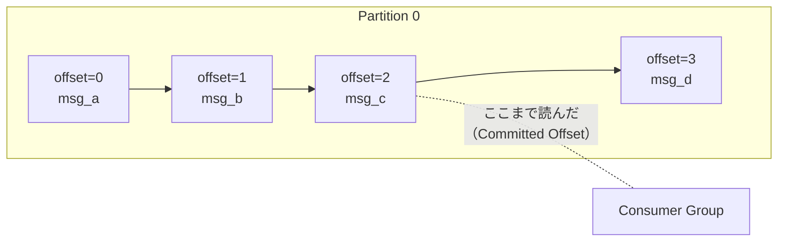
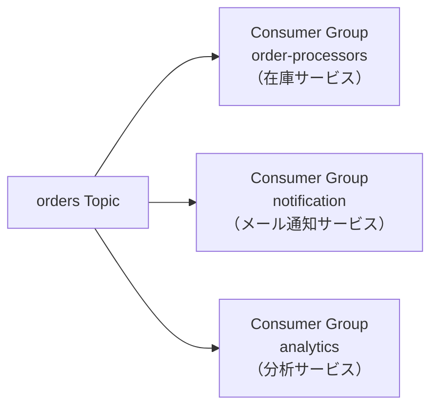
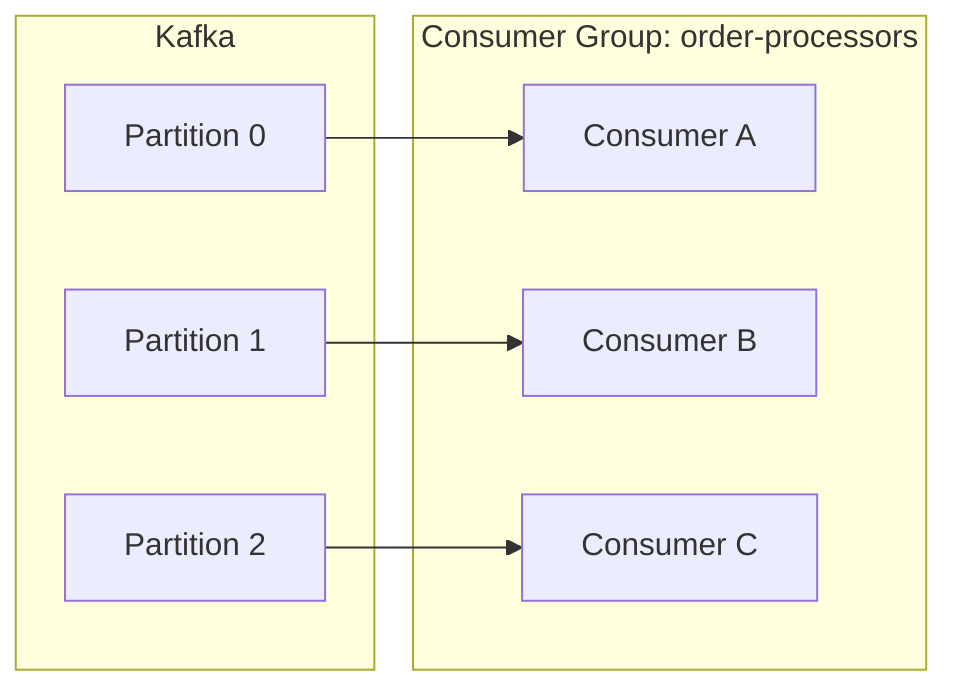
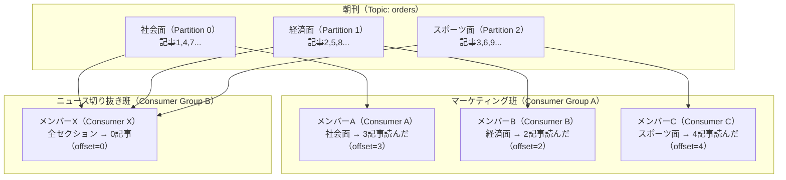
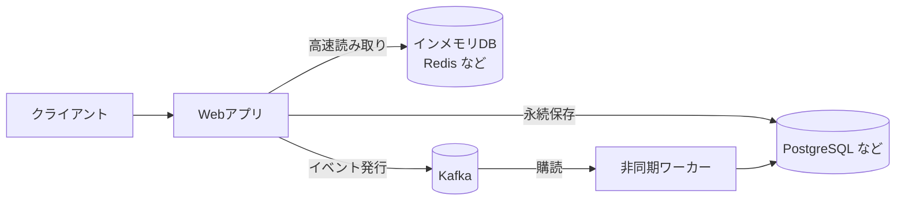

# はじめに：Kafkaとは何か

## Apache Kafkaとは

Apache Kafkaは、**Apache Software Foundation**が管理するオープンソースの**イベントストリーミングプラットフォーム**。
もともとLinkedInが社内の膨大なデータパイプライン問題を解決するために開発し、2011年にOSSとして公開された。

公式の定義では、以下の3つの機能を1つに統合したプラットフォームとされている。

1. イベントのストリームを**発行・購読**する
2. イベントを**永続的に保存**する（必要な限り）
3. イベントを**リアルタイムまたは遡って処理**する

→ [Apache Kafka 公式サイト](https://kafka.apache.org/)  
→ [公式 Introduction](https://kafka.apache.org/42/getting-started/introduction/)

---

## Kafkaの構成

Kafkaは**それ自体がストレージ**を持つ。イベントはBrokerのディスク上にログファイルとして書き込まれるため、外部のDBは必要ない。

| | 必要か |
|---|---|
| 外部DB | 不要（Kafkaが内部にログとして保存する） |
| ZooKeeper | 不要（KRaftモードの場合） |
| Broker プロセス | **必要**（これがKafkaの本体） |
| Producer / Consumer | アプリ側で実装する |

このリポジトリのDocker ComposeはKRaftモードで動作しており、Brokerプロセス1つで起動できる。

<details>
<summary>KRaftとは（補足）</summary>

Kafka 3.3以前はクラスター管理に**ZooKeeper**という別プロセスが必要だった。  
Kafka 3.3以降は**KRaft**モードが正式採用され、ZooKeeperが不要になった。  
現在の標準はKRaftモードであり、新規構築ではZooKeeperを使う必要はない。

</details>

---

## Kafkaが生まれた背景

サービスが複数に分かれると、「Aが起きたらBとCとDを動かす」という処理を直接API呼び出しで繋ぐと、以下の問題が起きる。

- BやCが落ちていたら処理が失われる
- Aは全員の応答を待たされる
- 新しいサービスEを追加するたびにAを修正しなければならない



Kafkaはこれを「イベントログ」という形で解決する。Aはログに書くだけ。BもCもDも、自分のペースでログを読む。



各サービスはKafkaに能動的にポーリングしに行く（PULL型）。Kafka側からプッシュはしない。  
各サービスが独立したポーリングループを持つため、処理速度や障害が互いに影響しない。

---

## 主要概念

各概念がKafka内のどこに位置するかを示した概観図。詳細は各項目を参照。



ProducerとConsumerは「背景」の図で登場したサービスそのもの。

| 背景の図 | 主要概念 |
|---|---|
| 注文サービス | Producer |
| 在庫サービス・メール通知サービス など | Consumer |

ただし「Consumer = サービス1つ」とは限らず、1つのサービス内に複数のConsumerを持つこともある。「Kafkaからメッセージを読む処理の単位」がConsumer。

### Event（イベント）
Kafkaにおける最小単位。「何かが起きた」という事実を記録したもの。  
以下の要素で構成される。

| 要素 | 説明 | 例 |
|---|---|---|
| Key | メッセージの識別子。同じKeyは同じPartitionに送られる | `"user-001"` |
| Value | メッセージの本体 | `{"action": "purchase", "amount": 3000}` |
| Timestamp | イベントが発生した時刻 | `2026-05-03T12:00:00Z` |
| Headers | 任意のメタデータ | トレースID など |

### Topic
イベントを格納する名前付きのログ。「orders」「user-events」など用途ごとに作る。

- **読んでも消えない** : 消費後もイベントは残り、保持期間（デフォルト7日）まで保存される
- **複数のProducer/Consumer** : 1つのTopicに対して複数のProducerが書き込め、複数のConsumerが独立して読める

### Partition
Topicを分割した単位。並列処理とスケールアウトのために使う。

- 同じKeyのイベントは常に同じPartitionに入る → **Partition内での順序が保証される**
- Partitionが多いほど並列処理の上限が上がる



### Producer
Topicにイベントを書き込むアプリケーション。  
どのPartitionに書くかはKafkaが自動で決める（Keyがある場合はKeyで振り分ける）。

### Consumer
Topicからイベントを読み取るアプリケーション。  
読んでもイベントは削除されない。どこまで読んだかはOffsetで管理される。

**ポーリングとは**

ConsumerはKafkaに対して「新着メッセージはあるか？」と繰り返し問い合わせ続ける動作のこと。  
WebSocketのようにサーバー側から届くのではなく、Consumer側から能動的に取りに行く（PULL型）。

新着がない場合はKafka側で一定時間（デフォルト500ms）待機してから「なし」を返す。  
Consumer側はそれを受けてすぐ次の問い合わせを行う、というループを繰り返す。

**無限ループでメモリが膨らまないのか？**

処理済みのメッセージは参照が解放されるためGCの対象になる。またConsumerが一度に取得するメッセージ数には上限（デフォルト500件）があり、バッファが無制限に積み上がる構造にはなっていない。

### Offset
各Partitionにおける「どこまで読んだか」を示す連番。  
Kafkaがグループごとに管理するため、Consumerが落ちても再起動後に続きから読める。



### Broker
Kafkaクラスターを構成するサーバープロセス。イベントの保存と配信を担う。これがKafkaの本体。

---

## Consumer Group

複数のConsumerをグループにまとめて、Partitionを分担して処理する仕組み。  
同じGroup内では1つのPartitionを1つのConsumerだけが担当する。

**基本は「1グループ = 1サービス」**



各サービスが独立したGroupを持ち、同じTopicを自分のペースで読む。

**グループ内のConsumer数を増やす = スケールアウト**

処理が追いつかない場合、同じGroupのConsumerを増やしてPartitionを分担する。ロードバランサーに近い役割だが、振り分けの単位はPartitionに固定される。



Consumer数がPartition数を超えた分はアイドルになるため、**Partition数がスケールアウトの上限**になる。

### Group・Partition・Offsetの関係

3つの概念はセットで動く。**図書館での新聞閲覧**に例えると分かりやすい。

| Kafka | 新聞の閲覧 |
|---|---|
| Topic | その日の朝刊（全ページ） |
| Partition | 各セクション（社会面・経済面・スポーツ面） |
| Consumer Group | 異なる目的で読むグループ |
| Consumer | 各グループ内でセクションを担当するメンバー |
| Offset | 各グループの「どこまで読んだか」を示すしおり |

マーケティング班（3人）: 社会面・経済面・スポーツ面を1人ずつ担当して並列で読み進める。  
ニュース切り抜き班（1人）: マーケティング班とは別のしおりを持つので、同じ朝刊を自分のペースで最初から読める。  
経済面担当がやめたら（Rebalance）、残りのメンバーが経済面も引き継ぐ。

どのセクションが先に読み終わるかは決まっておらず並行して進む。これがPartitionへの振り分けが順番でない理由でもある。



Offsetは「Group × Partition」の組み合わせごとに独立して管理される。マーケティング班が読み進めても、ニュース切り抜き班のoffsetには影響しない。

---

## 他のツールとの比較

| | Redis Pub/Sub | Redis Streams | RabbitMQ | Kafka |
|---|---|---|---|---|
| 永続性 | なし（揮発） | メモリ依存 | ディスク | **ディスク** |
| 読後のメッセージ | 消える | 手動削除が必要 | 消える | **残る** |
| 複数の受信者 | 全員に届く（ただし不在なら消える） | Consumer Group で分担 | 競合して1つが取る | **全員が独立して読める** |
| 再処理 | 不可 | 限定的 | 不可 | **できる（Offset指定）** |
| スループット | 高い | 中程度 | 中程度 | **非常に高い** |
| 主な用途 | リアルタイム通知 | 軽量なイベントログ | ジョブキュー | **イベントログ・ストリーム処理** |

Kafkaの最大の特徴は「読んでもメッセージが消えない」点。障害後の再処理や、複数サービスが同じイベントを独立して処理するユースケースに強い。

---

## Kafkaでできないこと

**キャッシュとしては使えない。**

WebアプリケーションでJSONデータをインメモリDB（Redisなど）に入れて高速化するような用途には向かない。Kafkaにはキーで値を直接取り出す仕組みがなく、読み取りは常に「Partitionを順番に読む」形になる。

```
# インメモリDB（Redisなど）なら即座にできる
GET user:001  → "Alice"

# Kafkaでは「user:001の今の値を返せ」という問い合わせができない
```

実際のシステムではKafkaが「イベントの通り道」を担い、データの保管は別のツールに委ねる構成になる。



| ツール | 役割 |
|---|---|
| インメモリDB（Redis など） | 高速な一時保管（キャッシュ・セッション） |
| MongoDB / PostgreSQL | データの永続保存 |
| Kafka | サービス間のイベント伝達・非同期処理 |

---

## このリポジトリで学ぶこと

このリポジトリでは **Producer API / Consumer API** を中心に扱う。

```
phase1: 基本的な送受信（Producer API / Consumer API）
phase2: Consumer Groupで負荷分散
phase3: Partitionとオフセット管理
best_practices: 本番運用の考え方
```

---

## 次のステップ

→ [フェーズ1：基本的な送受信](../README.md#フェーズ1基本的な送受信)

