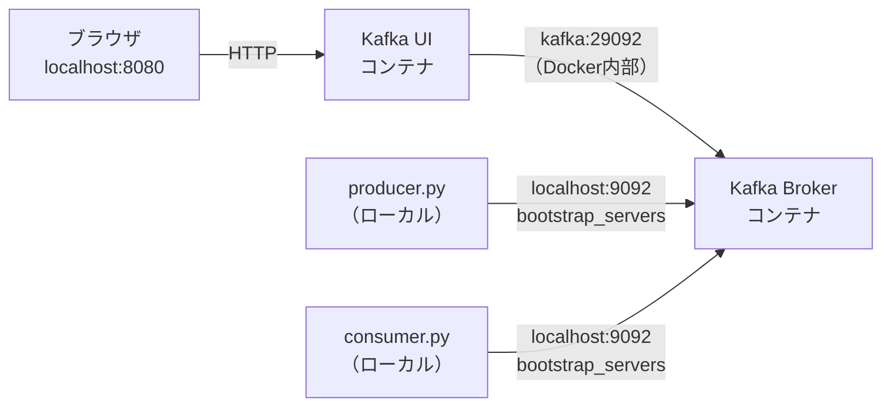

# フェーズ1：基本的な送受信

ProducerがTopicにメッセージを送り、ConsumerがTopicから読み取る、最も基本的な流れを体験する。

---

## このフェーズで学ぶこと

- KafkaをDockerで起動する
- PythonでProducerを実装してメッセージを送信する
- PythonでConsumerを実装してメッセージを受信する
- Kafka UIでTopicとメッセージを視覚的に確認する

---

## 接続構成

このフェーズでは3つのプロセスが動く。それぞれの接続先をまとめる。



**bootstrap_serversとは**

ProducerとConsumerがKafkaに最初に接続するためのアドレス。  
`localhost:9092` を指定することで、ローカルで動いているKafka Brokerに接続する。  
一度接続するとKafkaからクラスター全体の情報を受け取るため、「入口」として最低1つ指定すれば動く。

「bootstrap」はCSSフレームワークのBootstrapとは無関係で、分散システムの用語。「最初の足がかり」を意味し、クラスターへの初回接続点を指す。kafka-pythonライブラリが定めているパラメータ名で、自分で命名するものではない。

| 接続元 | アドレス | 用途 |
|---|---|---|
| Python（Producer/Consumer） | `localhost:9092` | bootstrap_servers に指定 |
| ブラウザ | `localhost:8080` | Kafka UIの管理画面 |

Kafka UIもバックエンドでKafka Brokerに接続しており、PythonスクリプトとKafka UIは別々にBrokerと接続している。

<details>
<summary>Docker環境でKafka UIの接続先が異なる理由（補足）</summary>

Docker環境では、コンテナ内から `localhost` は自分自身を指すため、Kafka UIコンテナから `localhost:9092` でKafkaコンテナに接続できない。そのためDocker内部専用のリスナー（`kafka:29092`）を別途用意している。直接インストールの場合はKafka UIもPythonスクリプトも同じ `localhost:9092` で接続できる。

</details>

---

## コードを読む

### [producer.py](producer.py)

`hello-topic` に5件のメッセージを1秒おきに送信して終了する。

```
KafkaProducer 作成（localhost:9092 に接続）
  ↓
{"id": 0, "text": "メッセージ 0"} を送信
{"id": 1, "text": "メッセージ 1"} を送信
...（1秒ごと）
  ↓
flush() → 未送信のメッセージをすべて送り切る
  ↓
close() → 接続を閉じて終了
```

- メッセージはJSON形式でシリアライズして送る
- `flush()` を呼ばないと送信が保留されたまま終了することがある
- **Producerは送り終わったら自動で終了する**

### [consumer.py](consumer.py)

`hello-topic` をポーリングし続け、メッセージが届くたびに表示する。Ctrl+C で停止。

```
KafkaConsumer 作成（group_id="hello-group"）
  ↓
ポーリングループ開始（Kafkaに「新着ある？」と繰り返し問い合わせる）
  ↓
メッセージ受信 → partition / offset / value を表示
  ↓
Ctrl+C → close() して終了
```

- `group_id` でConsumer Groupを指定する（phase2で詳しく扱う）
- `auto_offset_reset="earliest"` によりConsumer起動前に送られたメッセージも最初から読める
- `for message in consumer:` の内部でポーリングが自動的に動く
- **Consumerは明示的に止めるまで動き続ける**

---

## 起動

```bash
# kafka_study ディレクトリで実行
docker compose up -d
```

起動確認：

```bash
docker compose ps
```

`kafka` と `kafka-ui` の両方が `running` になっていればOK。

---

## Kafka UIの確認

ブラウザで http://localhost:8080 を開く。  
左メニューの「Topics」からTopicの一覧・メッセージ・Partitionの状態を確認できる。

---

## Python環境のセットアップ

ルートの手順（`mise trust` → `mise install` → `uv sync`）が済んでいれば追加作業は不要です。  
仮想環境が有効になっていない場合は以下を実行してください。

```bash
source .venv/bin/activate
```

---

## ハンズオン

### ステップ1：Consumerを起動する

別ターミナルでConsumerを先に起動しておく。

```bash
python phase1/consumer.py
```

メッセージ待受状態になる（何も表示されなければ正常）。

### ステップ2：Producerでメッセージを送る

別ターミナルでProducerを実行する。

```bash
python phase1/producer.py
```

Consumerのターミナルにメッセージが表示されることを確認する。

### ステップ3：Kafka UIで確認する

1. http://localhost:8080 を開く
2. Topics → `hello-topic` を選択
3. Messages タブで送信したメッセージを確認する

---

## 確認ポイント

- [ ] ConsumerがProducerより後から起動しても、既存メッセージを受信できるか試してみる
- [ ] Producerを複数回実行するとメッセージが積み重なることをKafka UIで確認する
- [ ] Consumerを一度止めて再起動したとき、続きから読めることを確認する

---

## 次のステップ

→ [フェーズ2：Consumer Group](../README.md#フェーズ2consumer-group)
