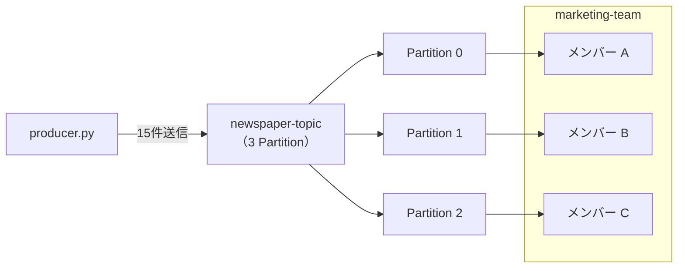
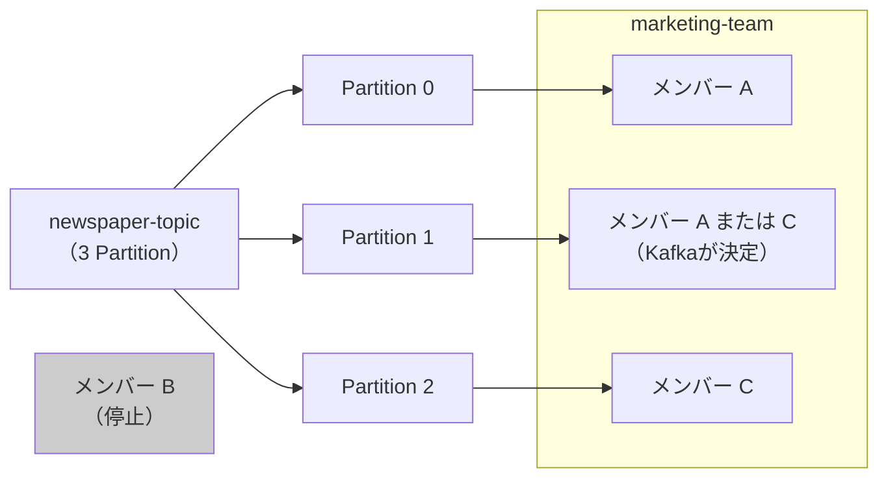

# フェーズ2：Consumer Group

同じTopicを複数のConsumerで分担して処理する仕組みを体験する。  
Consumer Groupの概念は→[intro：Consumer Group](../intro/README.md#consumer-group)を参照。

---

## このフェーズで学ぶこと

- Consumer Groupの動作を確認する
- 複数ConsumerでPartitionを分担して処理する
- Consumerが落ちたときの再バランス（Rebalance）を観察する
- 異なるGroupが同じTopicを独立して読めることを確認する

---

## コードを読む

### [producer.py](producer.py)

`newspaper-topic` にニュース記事を15件、0.5秒おきに送信して終了する。

```
KafkaProducer 作成（localhost:9092 に接続）
  ↓
{"id": 0, "title": "政府が新たな経済対策を発表"} を送信
{"id": 1, "title": "株式市場が急騰、過去最高値を更新"} を送信
...（0.5秒ごと・計15件）
  ↓
flush() → close() して終了
```

- **Producerは送り終わったら自動で終了する**

### [consumer.py](consumer.py)

`newspaper-topic` を `marketing-team`（マーケティング班）として受信する。引数で識別名（A/B/C）を指定する。

```
起動: python phase2/consumer.py A

KafkaConsumer 作成（group_id="marketing-team"）
  ↓
Kafkaがグループ内でPartitionを自動的に割り当てる
  ↓
担当Partitionの記事を受信 → [メンバー A] partition=0 ... と表示
  ↓
Ctrl+C → close() して終了
```

- A/B/C はターミナルのログで「どのメンバーがどの記事を受け取ったか」を区別するための識別名
- 同じ `group_id` で起動したConsumerは自動でPartitionを分担する
- **Consumerは明示的に止めるまで動き続ける**

### [consumer_another_group.py](consumer_another_group.py)

`newspaper-topic` を `news-clipping`（ニュース切り抜き班）として受信する。`marketing-team` とは独立してOffsetを管理するため、同じ記事を最初から読める。

```
KafkaConsumer 作成（group_id="news-clipping"）
  ↓
marketing-team グループのOffsetとは無関係に最初から読む
  ↓
Ctrl+C → close() して終了
```

- **同じ朝刊（Topic）を、目的の違うグループがそれぞれのペースで読める**

---

## 前提

- フェーズ1の環境（`docker compose up -d`）が起動していること
- 仮想環境が有効になっていること（`source .venv/bin/activate`）

Topicを事前に3 Partitionで作成する（デフォルトは1 Partitionのため）。

```bash
docker compose exec kafka /opt/kafka/bin/kafka-topics.sh \
  --bootstrap-server localhost:9092 \
  --create \
  --topic newspaper-topic \
  --partitions 3 \
  --replication-factor 1
```

**`kafka-topics.sh` について**

`kafka-topics.sh` はKafkaコンテナに同梱された管理用シェルスクリプト。`docker compose exec kafka` でコンテナ内のスクリプトを呼び出している。`--help` で利用可能なオプションを確認できる。

```bash
docker compose exec kafka /opt/kafka/bin/kafka-topics.sh --help
```

よく使うコマンド：

```bash
# 存在するTopicを一覧表示
docker compose exec kafka /opt/kafka/bin/kafka-topics.sh \
  --bootstrap-server localhost:9092 --list

# Topicの詳細（Partition数・レプリカ配置など）を確認
docker compose exec kafka /opt/kafka/bin/kafka-topics.sh \
  --bootstrap-server localhost:9092 \
  --describe --topic newspaper-topic
```

参考：[Kafka公式ドキュメント](https://kafka.apache.org/documentation/)

---

## ハンズオン

### ステップ1〜3：メンバー A・B・C を起動する

別々のターミナルでそれぞれ起動する。A/B/C は識別名で、同じコードを3つ同時に動かす。

```bash
# ターミナル1
python phase2/consumer.py A

# ターミナル2
python phase2/consumer.py B

# ターミナル3
python phase2/consumer.py C
```

3つ起動するとKafkaが自動でPartitionを割り当てる。ターミナルに以下のようなログが出れば正常。

```
[メンバー A] 受信待機中（Group: marketing-team）
[メンバー B] 受信待機中（Group: marketing-team）
[メンバー C] 受信待機中（Group: marketing-team）
```

現時点では割り当ては決まっているがメッセージはまだ届いていない状態。

### ステップ4：Producerで記事を送る（別ターミナル）

```bash
python phase2/producer.py
```

15件の記事が各メンバーに分散されて届く。どのメンバーがどのPartitionを担当しているかはログで確認できる。

```
[メンバー A] partition=0 offset=0 title=政府が新たな経済対策を発表
[メンバー B] partition=1 offset=0 title=株式市場が急騰、過去最高値を更新
[メンバー C] partition=2 offset=0 title=プロ野球開幕戦で接戦
```



**Kafka UIでも確認する**：Topics → newspaper-topic → Consumers タブを開くと、どのメンバーがどのPartitionを担当しているか一覧で見える。

### ステップ5：Rebalanceを観察する

メンバー B のターミナルで `Ctrl+C` を押して停止する。  
KafkaはConsumerが減ったことを検知し、残りのA・CにPartitionを再割り当て（Rebalance）する。



どのメンバーにPartitionが再割り当てされるかはKafkaのアルゴリズムが決めるため、実行ごとに異なる場合がある。

Rebalance自体はメンバー B を止めた時点で自動で起きる。メッセージの再分散を確認したい場合はProducerを再実行する。

```bash
python phase2/producer.py
```

**確認場所：**
- **ターミナル**：メンバー A・C のログに複数のPartitionの記事が混在して届くようになる
- **Kafka UI**：Topics → newspaper-topic → Consumers タブでリアルタイムに割り当てが変わる

### ステップ6：別Groupから読んでみる

```bash
python phase2/consumer_another_group.py
```

`news-clipping`（ニュース切り抜き班）として同じTopicを最初から読む。`marketing-team` が既に読み進めていても、別Groupは独立したOffsetを持つため先頭から受信できる。

**確認場所：** Kafka UI → Topics → newspaper-topic → Consumers タブに `news-clipping` グループが追加されて表示される。

---

## 確認ポイント

- [ ] 3つのメンバーが3つのPartitionを1つずつ担当していることをKafka UIで確認する
- [ ] メンバー数がPartition数より多い場合、余ったメンバーがアイドルになることを確認する
- [ ] 別GroupはOffset（読んだ位置）を共有しないことを確認する

---

## 次のステップ

→ [フェーズ3：Partitionとオフセット管理](../README.md#フェーズ3partitionとオフセット管理)
