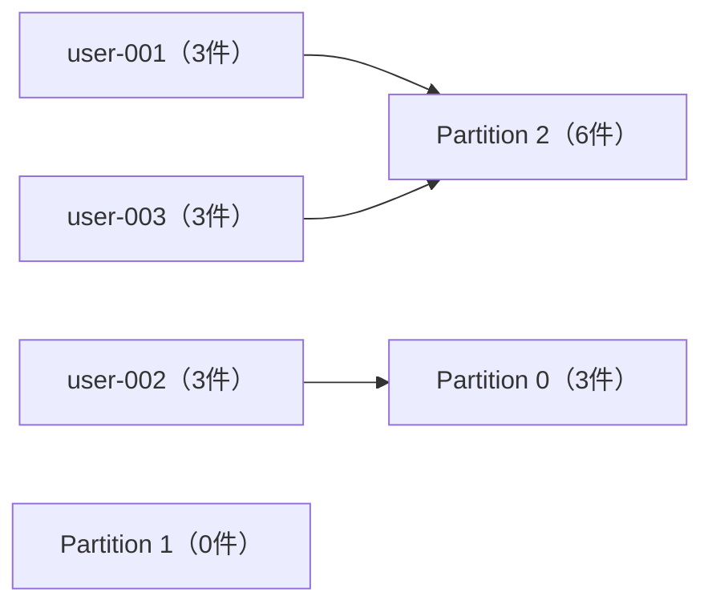
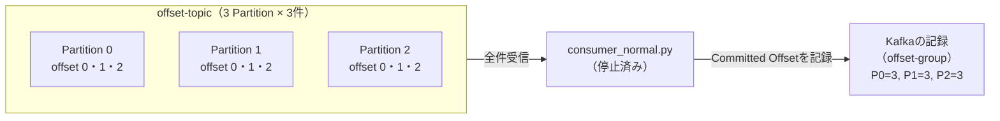
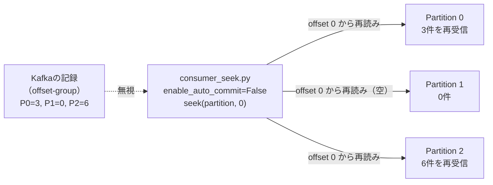

# フェーズ3：Partitionとオフセット管理

キーによるPartition振り分けと、オフセットを使った再処理を体験する。  
「あの時間帯の処理をやり直したい」がKafkaでどう実現されるかを理解する。  
Partition・Offsetの概念は→[intro：主要概念](../intro/README.md#主要概念)を参照。

---

## このフェーズで学ぶこと

- キーによるPartition振り分けの仕組みを理解する
- オフセットの自動管理と手動管理の違いを確認する
- オフセットを指定して過去のメッセージを再処理する

---

## コードを読む

### [producer_with_key.py](producer_with_key.py)

`user-001`〜`user-003` をキーにして9件のメッセージを送信する。キーを設定すると、**同じキーのメッセージは必ず同じPartitionに入る**。これによりユーザーごとのイベント順序が保証される。

```
KafkaProducer 作成（key_serializer・value_serializer を指定）
  ↓
key="user-001" value={"user_id": "user-001", "action": "イベント 0"} を送信
key="user-002" value={"user_id": "user-002", "action": "イベント 1"} を送信
key="user-003" value={"user_id": "user-003", "action": "イベント 2"} を送信
key="user-001" value=... （必ず同じPartitionに入る）
...（計9件）
  ↓
flush() → close() して終了
```

- **Producerは送り終わったら自動で終了する**

### [consumer_normal.py](consumer_normal.py)

`offset-topic` を通常の方法で受信する。オフセットはKafkaが自動でコミットする。

```
KafkaConsumer 作成（enable_auto_commit=True）
  ↓
ポーリングループ開始
  ↓
メッセージ受信 → partition / offset / key / value を表示
  ↓
Ctrl+C → close() して終了
```

- `enable_auto_commit=True` : 処理したオフセットをKafkaが定期的に自動保存する
- 再起動すると保存済みのOffsetの続きから読む
- **Consumerは明示的に止めるまで動き続ける**

### [consumer_seek.py](consumer_seek.py)

全Partitionのオフセットを0に強制移動して、メッセージを最初から再処理する。

```
KafkaConsumer 作成（enable_auto_commit=False）
  ↓
全Partition（0・1・2）を手動でassign
  ↓
各Partitionのoffsetを0にseek（先頭に移動）
  ↓
末尾まで読んだら終了
```

- `enable_auto_commit=False` : オフセットを自動保存しない（再実行しても常に0から読める）
- `consumer.seek(partition, 0)` : 指定Partitionの読み取り位置を強制移動する
- **末尾まで読んだら自動で終了する**

---

## 前提

- フェーズ1の環境（`docker compose up -d`）が起動していること
- 仮想環境が有効になっていること（`source .venv/bin/activate`）

Topicを事前に3 Partitionで作成する。

```bash
docker compose exec kafka /opt/kafka/bin/kafka-topics.sh \
  --bootstrap-server localhost:9092 \
  --create \
  --topic offset-topic \
  --partitions 3 \
  --replication-factor 1
```

**`kafka-topics.sh` について**

`kafka-topics.sh` はKafkaコンテナに同梱された管理用シェルスクリプト。`docker compose exec kafka` でコンテナ内のスクリプトを呼び出している。`--help` で利用可能なオプションを確認できる。

```bash
docker compose exec kafka /opt/kafka/bin/kafka-topics.sh --help
```

よく使うコマンド：

```bash
# 存在するTopicを一覧表示
docker compose exec kafka /opt/kafka/bin/kafka-topics.sh \
  --bootstrap-server localhost:9092 --list

# Topicの詳細（Partition数・レプリカ配置など）を確認
docker compose exec kafka /opt/kafka/bin/kafka-topics.sh \
  --bootstrap-server localhost:9092 \
  --describe --topic offset-topic
```

参考：[Kafka公式ドキュメント](https://kafka.apache.org/documentation/)

---

## ハンズオン

### ステップ1：キー付きでメッセージを送る

```bash
python phase3/producer_with_key.py
```

キーの種類数とPartition数が一致する保証はない（ユーザーは増え続けるがPartition数は固定）。そのため Kafka は「キーのハッシュ値 ÷ Partition数 の余り」でどのPartitionに入るかを決める。ハッシュの分散は均等とは限らないため、偏りが出ることがある。

今回の3キー・3Partitionでは以下のように振り分けられる。



- user-001 と user-003 はハッシュ値 ÷ 3 の余りがたまたま同じ → Partition 2 に混在する
- Partition 1 はどのキーのハッシュ値も振られず 0件になる
- **重要なのは「同じキーが毎回必ず同じPartitionに入る」こと**（順序保証の根拠）

**Kafka UI での確認方法**

Topics → offset-topic → Messages を開き、画面上部の **Partition** フィルターで絞り込む。

- Partition **0** を選択 → user-002 のメッセージのみ 3件が表示される
- Partition **2** を選択 → user-001 と user-003 のメッセージが交互に 6件表示される

### ステップ2：consumer_normal.py で受信する（Committed Offsetを記録させる）

```bash
python phase3/consumer_normal.py
```

9件は一瞬で届くため、止める前に全件受信済みになる。受信を確認したら `Ctrl+C` で停止する。

`enable_auto_commit=True` の設定により、Kafkaは受信のたびにConsumer Group `offset-group` の「どこまで読んだか」を自動で記録している。停止後も記録は残る。



Topics → offset-topic → **Consumers タブ**を開くと、offset-group の **Consumer Lag = 0** になっていることを確認できる。Consumer Lag = 0 は「全メッセージを読み切り、Committed Offsetが末尾に達した状態」を意味する。

### ステップ3：consumer_seek.py でOffset 0から再処理する

```bash
python phase3/consumer_seek.py
```

`consumer.seek(partition, 0)` で全PartitionのOffset を強制的に0に移動してから読み直す。`enable_auto_commit=False` のため再処理後もKafkaの記録は上書きされない。末尾まで読んだら自動で終了する。



「消費済みのメッセージをあとから読み直せる」というKafkaの特徴を確認する。

---

## 確認ポイント

- [ ] 同じキーのメッセージが常に同じPartitionに入ることをKafka UIで確認する
- [ ] consumer_normal.py を途中で止めて再起動したとき、続きから読めることを確認する
- [ ] consumer_seek.py で同じメッセージが再度処理されることを確認する
- [ ] Kafka UIの「Consumer Groups」でCommitted Offsetを確認する

---

## 次のステップ

→ [ベストプラクティス](../README.md#ベストプラクティス)
